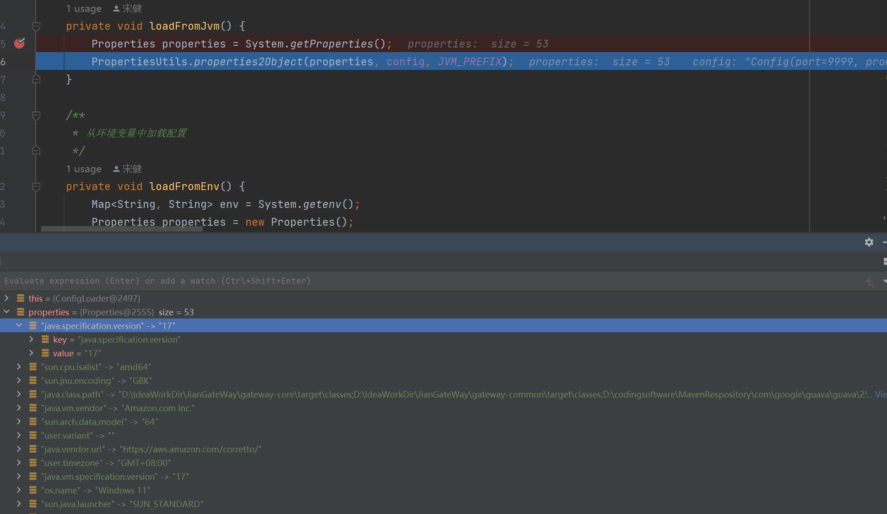

# 【JianGateWay-5】网关静态配置与加载

## 网关静态配置

网关的配置内容有：

- 自己的端口和各种组件的端口
- 配置中心地址
- 注册中心地址
- 开发环境
- Netty 相关配置
- 等等（需要什么就定义什么）

```JAVA
@Data
public class Config {
    /**
     * 端口
     */
    private int port = 8888;

    /**
     * 普罗帕米修斯端口
     */
    private int prometheusPort = 18000;

    /**
     * 应用名
     */
    private String applicationName = "api-gateway";

    /**
     * 配置中心地址
     */
    private String registryAddress = "127.0.0.1:8848";

    /**
     * 开发环境
     */
    private String env = "dev";

    /**
     * netty 的 bossGroup 数量
     */
    private int eventLoopGroupBossNum = 1;

    /**
     * netty 的 workerGroup 数量
     */
    private int eventLoopGroupWorkerNum = Runtime.getRuntime().availableProcessors();
    //private int eventLoopGroupWorkerNum = 1;

    /**
     * 最大报文长度
     */
    private int maxContentLength = 64 * 1024 * 1024;

    /**
     * 默认单异步模式
     */
    private boolean whenComplete = true;

    // -------------------------------------	Http Async 参数选项：

    /**
     * 连接超时时间
     */
    private int httpConnectTimeout = 30 * 1000;

    /**
     * 请求超时时间
     */
    private int httpRequestTimeout = 30 * 1000;

    /**
     * 客户端请求重试次数
     */
    private int httpMaxRequestRetry = 2;

    /**
     * 客户端请求最大连接数
     */
    private int httpMaxConnections = 10000;

    /**
     * 客户端每个地址支持的最大连接数
     */
    private int httpConnectionsPerHost = 8000;

    /**
     * 客户端空闲连接超时时间, 默认60秒
     */
    private int httpPooledConnectionIdleTimeout = 60 * 1000;

    /**
     * =============== disruptor 相关
     */
    private String bufferType = "parallel";

    private int bufferSize = 1024 * 16;

    private int processThread = Runtime.getRuntime().availableProcessors();

    private String waitStrategy = "blocking";

    /**
     * disruptor 的等待策略
     * @return
     */
    public WaitStrategy getWaitStrategy () {
        switch (waitStrategy) {
            case "blocking":
                return new BlockingWaitStrategy();
            case "busySpin":
                return new BusySpinWaitStrategy();
            case "yielding":
                return new YieldingWaitStrategy();
            case "sleeping":
                return new SleepingWaitStrategy();
            default:
                return new BlockingWaitStrategy();
        }
    }
}
```

## 配置加载 Config Loader

配置加载器 Config Loader 需要完成的功能就是 **从不同源，按照优先级加载网关的配置内容** 。

具体配置的来源有五个：

- 运行参数
- JVM 参数
- 环境变量
- 配置文件
- 配置对象默认值

从上到下会按照优先级覆盖，所以实现起来是反过来的。

```JAVA
public class ConfigLoader {

    private static final String CONFIG_FILE = "gateway.properties";

    private static final String ENV_PREFIX = "GATEWAY_";

    private static final String JVM_PREFIX = "gateway.";

    /**
     * ConfigLoader 使用 单例设计模式 构造
     */
    private static final ConfigLoader INSTANCE = new ConfigLoader();

    /**
     * 存放配置
     */
    private Config config;

    private ConfigLoader() {}

    public static ConfigLoader getInstance() {
        return INSTANCE;
    }

    /**
     * 获取配置
     * @return
     */
    public static Config getConfig() {
        return INSTANCE.config;
    }

    /**
     * 优先级高的会覆盖优先级低的
     * 运行参数 -- jvm 参数 -- 环境变量 -- 配置文件 -- 配置对象默认值
     * @param args
     * @return
     */
    public Config load(String[] args) {
        // 默认值
        config = new Config();
        // 配置文件
        loadFromConfigFile();
        // 环境变量
        loadFromEnv();
        // jvm 参数
        loadFromJvm();
        // 运行参数
        loadFromArgs(args);
        return config;
    }

    /**
     * 从运行参数中读取配置
     */
    private void loadFromArgs(String[] args) {
        if (args != null && args.length > 0) {
            Properties properties = new Properties();
            for (String arg : args) {
                if (arg.startsWith("--") && arg.contains("=")) {
                    properties.put(arg.substring(2, arg.indexOf("=")), arg.substring(arg.indexOf("=") + 1));
                }
            }
            PropertiesUtils.properties2Object(properties, config);
        }
    }

    /**
     * 从 JVM 参数中读取配置
     */
    private void loadFromJvm() {
        Properties properties = System.getProperties();
        PropertiesUtils.properties2Object(properties, config, JVM_PREFIX);
    }

    /**
     * 从环境变量中加载配置
     */
    private void loadFromEnv() {
        Map<String, String> env = System.getenv();
        Properties properties = new Properties();
        properties.putAll(env);
        PropertiesUtils.properties2Object(properties, config, ENV_PREFIX);
    }

    /**
     * 从配置文件中加载配置
     * @return
     */
    private void loadFromConfigFile() {
        InputStream inputStream = ConfigLoader.class.getClassLoader().getResourceAsStream(CONFIG_FILE);
        if (inputStream != null) {
            Properties properties = new Properties();
            try {
                properties.load(inputStream);
                // 把属性复制到 config 对象中
                PropertiesUtils.properties2Object(properties, config);
            } catch (IOException e) {
                log.warn("load config file {} error", CONFIG_FILE, e);
            } finally {
                try {
                    inputStream.close();
                } catch (IOException e) {
                    //
                }
            }
        }
    }
}
```

这里封装了一个工具类 PropertiesUtils，便于我们将指定 properties 中以特定前缀开头的属性添加到配置中。

Properties 是 HashTable 的实现类，以 key-value 的形式存储：



Properties 的 `load()` 把硬盘中保存的文件（键值对），读取到集合中使用。

- `void load(InputStream inStream)`

- `void load(Read reader)`

### PropertiesUtils

properties2Object 需要传入三个参数：

- Properties p：保存好的属性集合
- Object object：要设置的目标对象
- String prefix：属性前缀
  - 比如，我知道配置文件中所有关于网关的配置的开头都是 `GATEWAY_ `
  - 那么，我们在加载的时候只会找这个开头的属性

```JAVA
public class PropertiesUtils {

    public static void properties2Object(final Properties p, final Object object, String prefix) {
        // 通过反射获取 object 的方法
        Method[] methods = object.getClass().getMethods();
        for (Method method : methods) {
            String mn = method.getName();
            // 拿到所有的 set 方法，进行遍历
            if (mn.startsWith("set")) {
                try {
                	// set 后第二个字符开始
                    String tmp = mn.substring(4);
                    // 把 set 后第一个字符取出
                    String first = mn.substring(3, 4);
                    String key = prefix + first.toLowerCase() + tmp;
                    // 从 source 中找到对应的属性
                    String property = p.getProperty(key);
                    if (property != null) {
                        Class<?>[] pt = method.getParameterTypes();
                        if (pt != null && pt.length > 0) {
                            String cn = pt[0].getSimpleName();
                            Object arg = null;
                            // 根据参数类型进行类型转换
                            if (cn.equals("int") || cn.equals("Integer")) {
                                arg = Integer.parseInt(property);
                            } else if (cn.equals("long") || cn.equals("Long")) {
                                arg = Long.parseLong(property);
                            } else if (cn.equals("double") || cn.equals("Double")) {
                                arg = Double.parseDouble(property);
                            } else if (cn.equals("boolean") || cn.equals("Boolean")) {
                                arg = Boolean.parseBoolean(property);
                            } else if (cn.equals("float") || cn.equals("Float")) {
                                arg = Float.parseFloat(property);
                            } else if (cn.equals("String")) {
                                arg = property;
                            } else {
                                continue;
                            }
                            // 调用对应的 set 方法，把参数设置到对象中
                            method.invoke(object, arg);
                        }
                    }
                } catch (Throwable ignored) {
                }
            }
        }
    }

    public static void properties2Object(final Properties p, final Object object) {
        properties2Object(p, object, "");
    }
}
```


