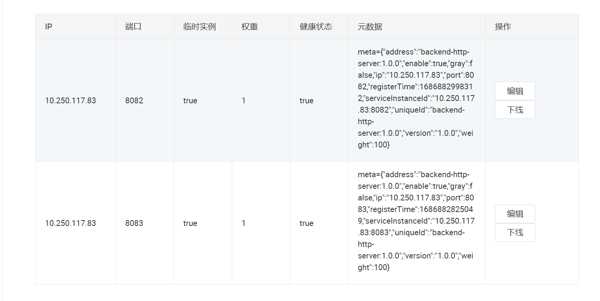

# 【JianGateWay-6】整合Nacos

## 注册中心


面向接口编程，先写接口！因为具体的配置中心的实现有很多种，不一定是 Nacos，面向接口可以不需要改变大量代码，只需要修改底下的实现即可。

### 接口模块

定义了两个接口：

#### RegisterCenter

定义了注册中心的四个方法：

- 注册
- 注销
- 初始化
- 订阅服务的变更信息

```JAVA
public interface RegisterCenter {

    /**
     * 初始化
     * @param regsiterAddress
     * @param env
     */
    void init(String regsiterAddress, String env);

    /**
     * 注册
     * @param serviceDefinition
     * @param serviceInstance
     */
    void register(ServiceDefinition serviceDefinition, ServiceInstance serviceInstance);

    /**
     * 注销
     * @param serviceDefinition
     * @param serviceInstance
     */
    void deregister(ServiceDefinition serviceDefinition, ServiceInstance serviceInstance);

    /**
     * 订阅所有服务的变更
     * @param registerCenterListener
     */
    void subscribeAllServices(RegisterCenterListener registerCenterListener);
}
```

#### RegisterCenterListener

服务变更的监听器模块，一旦监听到了服务变更，就会调用 onChange 的逻辑。

```JAVA
public interface RegisterCenterListener {

    /**
     * 发生变化后的逻辑
     * @param serviceDefinition
     * @param serviceInstanceSet
     */
    void onChange(ServiceDefinition serviceDefinition, Set<ServiceInstance> serviceInstanceSet);
}
```

### 服务定义与服务实例

如何定义一个服务？如何定义一个服务的实例？

#### ServiceDefinition

接下来需要设计服务的定义。

```JAVA
/**
 * 资源服务定义类：无论下游是什么样的服务都需要进行注册
 */
@Builder
public class ServiceDefinition implements Serializable {

	private static final long serialVersionUID = -8263365765897285189L;

	/**
	 * 	唯一的服务ID: serviceId:version
	 */
	private String uniqueId;

	/**
	 * 	服务唯一id
	 */
	private String serviceId;

	/**
	 * 	服务的版本号
	 */
	private String version;

	/**
	 * 	服务的具体协议：http(mvc http) dubbo ..
	 */
	private String protocol;

	/**
	 * 	路径匹配规则：访问真实ANT表达式：定义具体的服务路径的匹配规则
	 */
	private String patternPath;

	/**
	 * 	环境名称
	 */
	private String envType;

	/**
	 * 	服务启用禁用
	 */
	private boolean enable = true;

	/**
	 * 	服务列表信息：
	 */
	private Map<String /* invokerPath */, ServiceInvoker> invokerMap;


	public ServiceDefinition() {
		super();
	}

	public ServiceDefinition(String uniqueId, String serviceId, String version, String protocol, String patternPath,
                             String envType, boolean enable, Map<String, ServiceInvoker> invokerMap) {
		super();
		this.uniqueId = uniqueId;
		this.serviceId = serviceId;
		this.version = version;
		this.protocol = protocol;
		this.patternPath = patternPath;
		this.envType = envType;
		this.enable = enable;
		this.invokerMap = invokerMap;
	}

	@Override
	public boolean equals(Object o) {
		if(this == o) return true;
		if(this == null || getClass() != o.getClass()) return false;
		ServiceDefinition serviceDefinition = (ServiceDefinition)o;
		return Objects.equals(uniqueId, serviceDefinition.uniqueId);
	}

	@Override
	public int hashCode() {
		return Objects.hash(uniqueId);
	}
    
	// SETTER GETTER....
}
```

#### ServiceInstance

一个服务定义，可以对应多个服务实例，后续可在这多个服务实例上进行 LoadBalance。



```JAVA
/**
 * 一个服务定义会对应多个服务实例
 */
public class ServiceInstance implements Serializable {

	private static final long serialVersionUID = -7559569289189228478L;

	/**
	 * 	服务实例ID: ip:port
	 */
	protected String serviceInstanceId;

	/**
	 * 	服务定义唯一id： uniqueId
	 */
	protected String uniqueId;

	/**
	 * 	服务实例地址： ip:port
	 */
	protected String ip;

	protected int port;

	/**
	 * 	标签信息
	 */
	protected String tags;

	/**
	 * 	权重信息
	 */
	protected Integer weight;

	/**
	 * 	服务注册的时间戳：后面我们做负载均衡，warmup预热
	 */
	protected long registerTime;

	/**
	 * 	服务实例启用禁用
	 */
	protected boolean enable = true;

	/**
	 * 	服务实例对应的版本号
	 */
	protected String version;

	/**
	 * 标识是否是灰度服务
	 */
	@Getter
	@Setter
	private boolean gray;

	public ServiceInstance() {
		super();
	}

	// GETTER SETTER...
    
	@Override
	public boolean equals(Object o) {
		if(this == o) {
			return true;
		}
		if(this == null || getClass() != o.getClass()) {
			return false;
		}
		ServiceInstance serviceInstance = (ServiceInstance)o;
		return Objects.equals(serviceInstanceId, serviceInstance.serviceInstanceId);
	}

	@Override
	public int hashCode() {
		return Objects.hash(serviceInstanceId);
	}
}
```

### Nacos实现类

需要实现 RegisterCenter 接口，并且定义监听器实现。

关键在于  doSubscribeAllServices 方法的逻辑：

1. 获取已经订阅了的服务列表 getSubscribeServices
2. 分页获取当前所有服务列表 getServicesOfServer
3. 遍历全集，判断是否在已订阅集中
   - 如果存在，则跳过
   - 如果不存在，针对新的服务添加时间监听

```JAVA
/**
 * NacosRegisterCenter
 * @description
 * @author SongJian
 * @date 2023/6/9 21:12
 * @version
 */
@Slf4j
public class NacosRegisterCenter implements RegisterCenter {
    /**
     * 注册中心地址
     */
    private String registerAddress;

    /**
     * 开发环境定义
     */
    private String env;

    /**
     * 主要用于维护服务实例信息
     * NamingService 接口提供了大量与服务实例相关的方法
     */
    private NamingService namingService;

    /**
     * 主要用于维护服务定义信息
     */
    private NamingMaintainService namingMaintainService;

    /**
     * 监听器列表
     */
    private List<RegisterCenterListener> registerCenterListenerList = new CopyOnWriteArrayList<>();

    /**
     * 初始化方法
     * @param registerAddress 注册中心地址
     * @param env 环境
     */
    @Override
    public void init(String registerAddress, String env) {
        // 初始化设置地址、环境
        this.registerAddress = registerAddress;
        this.env = env;

        try {
            // 通过工厂创建好操作服务实例和服务定义的接口实现类
            this.namingMaintainService = NamingMaintainFactory.createMaintainService(registerAddress);
            this.namingService = NamingFactory.createNamingService(registerAddress);
        } catch (NacosException e) {
            throw new RuntimeException(e);
        }
    }

    /**
     * 注册
     * @param serviceDefinition 服务定义
     * @param serviceInstance 服务实例
     */
    @Override
    public void register(ServiceDefinition serviceDefinition, ServiceInstance serviceInstance) {
        try {
            // 构造 nacos 服务实例信息
            // 因为我们要把自定义的信息转化成 nacos 能看懂的
            Instance nacosInstance = new Instance();
            nacosInstance.setInstanceId(serviceInstance.getServiceInstanceId());
            nacosInstance.setPort(serviceInstance.getPort());
            nacosInstance.setIp(serviceInstance.getIp());
            nacosInstance.setMetadata(Map.of(GatewayConst.META_DATA_KEY, JSON.toJSONString(serviceInstance)));

            // 把服务实例注册到 nacos
            namingService.registerInstance(serviceDefinition.getServiceId(), env, nacosInstance);

            // 更新服务定义
            namingMaintainService.updateService(serviceDefinition.getServiceId(), env, 0,
                    Map.of(GatewayConst.META_DATA_KEY, JSON.toJSONString(serviceDefinition)));

            log.info("注册完成： {} {}", serviceDefinition, serviceInstance);
        } catch (NacosException e) {
            throw new RuntimeException(e);
        }
    }

    /**
     * 注销
     * @param serviceDefinition
     * @param serviceInstance
     */
    @Override
    public void deregister(ServiceDefinition serviceDefinition, ServiceInstance serviceInstance) {
        try {
            namingService.deregisterInstance(serviceDefinition.getServiceId(),
                    env, serviceInstance.getIp(), serviceInstance.getPort());
        } catch (NacosException e) {
            throw new RuntimeException(e);
        }
    }

    /**
     * 订阅所有服务
     * @param registerCenterListener
     */
    @Override
    public void subscribeAllServices(RegisterCenterListener registerCenterListener) {
        // 把监听器添加到监听器列表中
        registerCenterListenerList.add(registerCenterListener);
        // 订阅
        doSubscribeAllServices();
        // 可能有新服务加入，所以需要有一个定时任务来检查
        ScheduledExecutorService scheduledThreadPool = Executors
                .newScheduledThreadPool(1, new NameThreadFactory("doSubscribeAllServices"));
        scheduledThreadPool.scheduleWithFixedDelay(() -> doSubscribeAllServices(),
                10, 10, TimeUnit.SECONDS);

    }

    /**
     * 订阅逻辑实现：
     *      1、namingService 分页拉取当前所有服务
     *      2、遍历服务，为每一个服务添加事件监听器（这个事件监听器能够监听对应服务的变化）
     */
    private void doSubscribeAllServices() {
        try {
            // 已经订阅的服务
            Set<String> subscribeService = namingService.getSubscribeServices().stream()
                    .map(ServiceInfo::getName).collect(Collectors.toSet());

            int pageNo = 1;
            int pageSize = 100;

            // 分页从 nacos 拿到服务列表
            List<String> serviseList = namingService.getServicesOfServer(pageNo, pageSize, env).getData();

            while (CollectionUtils.isNotEmpty(serviseList)) {
                log.info("服务列表大小为： {}", serviseList.size());

                // 遍历服务列表中的所有服务
                for (String service : serviseList) {
                    if (subscribeService.contains(service)) {
                        // 如果服务已经被订阅了，跳过
                        continue;
                    }
                    // 没有订阅的服务进行订阅
                    // nacos 事件监听器
                    EventListener eventListener = new NacosRegisterListener();
                    // 设置对该服务进行监听
                    eventListener.onEvent(new NamingEvent(service, null));
                    // namingService 用一个 ConcurrentSet 维护所有监听
                    namingService.subscribe(service, env, eventListener);
                    log.info("订阅服务： {} {}", service, env);
                }
                // 继续分页获取服务列表
                serviseList = namingService.getServicesOfServer(++pageNo, pageSize, env).getData();
            }
        } catch (NacosException e) {
            throw new RuntimeException(e);
        }
    }

    /**
     * 监听器，专门监听 NamingEvent
     *
     * 也就是服务实例变更的情况
     */
    public class NacosRegisterListener implements EventListener {

        @Override
        public void onEvent(Event event) {
            if (event instanceof NamingEvent) {

                NamingEvent namingEvent = (NamingEvent) event;
                String serviceName = namingEvent.getServiceName();

                try {
                    //获取服务定义信息
                    Service service = namingMaintainService.queryService(serviceName, env);
                    ServiceDefinition serviceDefinition = JSON.parseObject(service.getMetadata()
                            .get(GatewayConst.META_DATA_KEY), ServiceDefinition.class);

                    //获取服务实例信息
                    List<Instance> allInstances = namingService.getAllInstances(service.getName(), env);
                    Set<ServiceInstance> set = new HashSet<>();

                    for (Instance instance : allInstances) {
                        ServiceInstance serviceInstance = JSON.parseObject(instance.getMetadata()
                                .get(GatewayConst.META_DATA_KEY), ServiceInstance.class);
                        set.add(serviceInstance);
                    }
                    // 调用注册中心的监听器，将服务定义和服务实例进行缓存
                    registerCenterListenerList.stream().forEach(l -> l.onChange(serviceDefinition, set));
                } catch (NacosException e) {
                    throw new RuntimeException(e);
                }
            }
        }
    }
}
```

### 本地动态配置缓存

工具类，用于帮助缓存服务定义、服务实例、规则等信息。

```JAVA
/**
 * 动态服务缓存配置管理类
 */
public class DynamicConfigManager {

	/**
	 * 服务的定义集合：uniqueId 代表服务的唯一标识
	 */
	private ConcurrentHashMap<String /* uniqueId */ , ServiceDefinition>  serviceDefinitionMap = new ConcurrentHashMap<>();

	/**
	 * 服务的实例集合：uniqueId 与一对服务实例对应
	 */
	private ConcurrentHashMap<String /* uniqueId */ , Set<ServiceInstance>>  serviceInstanceMap = new ConcurrentHashMap<>();

	/**
	 * 规则集合
	 */
	private ConcurrentHashMap<String /* ruleId */ , Rule>  ruleMap = new ConcurrentHashMap<>();

	/**
	 * 路径以及规则集合
	 */
	private ConcurrentHashMap<String /* 路径 */, Rule> pathRuleMap = new ConcurrentHashMap<>();

	/**
	 * 服务以及规则集合
	 */
	private ConcurrentHashMap<String /* 服务名 */, List<Rule>> serverRuleMap = new ConcurrentHashMap<>();

	private DynamicConfigManager() {
	}

	private static class SingletonHolder {
		private static final DynamicConfigManager INSTANCE = new DynamicConfigManager();
	}


	/***************** 	对服务定义缓存进行操作的系列方法 	***************/

	public static DynamicConfigManager getInstance() {
		return SingletonHolder.INSTANCE;
	}

	public void putServiceDefinition(String uniqueId,
			ServiceDefinition serviceDefinition) {

		serviceDefinitionMap.put(uniqueId, serviceDefinition);;
	}

	public ServiceDefinition getServiceDefinition(String uniqueId) {
		return serviceDefinitionMap.get(uniqueId);
	}

	public void removeServiceDefinition(String uniqueId) {
		serviceDefinitionMap.remove(uniqueId);
	}

	public ConcurrentHashMap<String, ServiceDefinition> getServiceDefinitionMap() {
		return serviceDefinitionMap;
	}

	/***************** 	对服务实例缓存进行操作的系列方法 	***************/

	public Set<ServiceInstance> getServiceInstanceByUniqueId(String uniqueId, boolean gray){
		Set<ServiceInstance> serviceInstances = serviceInstanceMap.get(uniqueId);
		if (CollectionUtils.isEmpty(serviceInstances)) {
			// 如果为空，直接返回
			return Collections.emptySet();
		}
		// 如果是灰度，则要过滤出灰度服务
		if (gray) {
			return serviceInstances.stream()
					.filter(ServiceInstance::isGray)
					.collect(Collectors.toSet());
		}
		// 否则，正常返回
		return serviceInstances;
	}

	public void addServiceInstance(String uniqueId, ServiceInstance serviceInstance) {
		Set<ServiceInstance> set = serviceInstanceMap.get(uniqueId);
		set.add(serviceInstance);
	}

	public void addServiceInstance(String uniqueId, Set<ServiceInstance> serviceInstanceSet) {
		serviceInstanceMap.put(uniqueId, serviceInstanceSet);
	}

	public void updateServiceInstance(String uniqueId, ServiceInstance serviceInstance) {
		Set<ServiceInstance> set = serviceInstanceMap.get(uniqueId);
		Iterator<ServiceInstance> it = set.iterator();
		while(it.hasNext()) {
			ServiceInstance is = it.next();
			if(is.getServiceInstanceId().equals(serviceInstance.getServiceInstanceId())) {
				it.remove();
				break;
			}
		}
		set.add(serviceInstance);
	}

	public void removeServiceInstance(String uniqueId, String serviceInstanceId) {
		Set<ServiceInstance> set = serviceInstanceMap.get(uniqueId);
		Iterator<ServiceInstance> it = set.iterator();
		while(it.hasNext()) {
			ServiceInstance is = it.next();
			if(is.getServiceInstanceId().equals(serviceInstanceId)) {
				it.remove();
				break;
			}
		}
	}

	public void removeServiceInstancesByUniqueId(String uniqueId) {
		serviceInstanceMap.remove(uniqueId);
	}


	/***************** 	对规则缓存进行操作的系列方法 	***************/

	public void putRule(String ruleId, Rule rule) {
		ruleMap.put(ruleId, rule);
	}

	public void putAllRule(List<Rule> ruleList) {
		ConcurrentHashMap<String, Rule> newRuleMap = new ConcurrentHashMap<>();
		ConcurrentHashMap<String, Rule> newPathMap = new ConcurrentHashMap<>();
		ConcurrentHashMap<String, List<Rule>> newServiceMap = new ConcurrentHashMap<>();

		for (Rule rule : ruleList) {
			newRuleMap.put(rule.getId(), rule);
			List<Rule> rules = newServiceMap.get(rule.getServiceId());
			if (rules == null) {
				rules = new ArrayList<>();
			}
			rules.add(rule);
			newServiceMap.put(rule.getServiceId(), rules);

			List<String> paths = rule.getPaths();
			for (String path : paths) {
				String key = rule.getServiceId() + DIT_SEPARATOR + path;
				newPathMap.put(key, rule);
			}
		}
		ruleMap = newRuleMap;
		pathRuleMap = newPathMap;
		serverRuleMap = newServiceMap;
	}

	public Rule getRule(String ruleId) {
		return ruleMap.get(ruleId);
	}

	public void removeRule(String ruleId) {
		ruleMap.remove(ruleId);
	}

	public ConcurrentHashMap<String, Rule> getRuleMap() {
		return ruleMap;
	}

	/**
	 * 根据路径获取规则
	 * @param path
	 * @return
	 */
	public Rule getRuleByPath (String path) {
		return pathRuleMap.get(path);
	}

	/**
	 * 根据服务id获取规则集合
	 * @param serviceId
	 * @return
	 */
	public List<Rule> getRuleByServiceId(String serviceId) {
		return serverRuleMap.get(serviceId);
	}
}
```

### Bootstrap

在启动类中添加网关的注册并订阅的方法：

```JAVA
    /**
     * 注册与订阅
     * @param config
     * @return
     */
    private static RegisterCenter registerAndSubscribe(Config config) {

        // SPI 机制，通过线程上下文类加载器加载实现类
        ServiceLoader<RegisterCenter> serviceLoader = ServiceLoader.load(RegisterCenter.class);
        final RegisterCenter registerCenter = serviceLoader.findFirst().orElseThrow(() -> {
            log.error("没有找到【注册中心】的具体实现类！");
            return new RuntimeException("没有找到【注册中心】的具体实现类！");
        });

        // 注册中心初始化
        registerCenter.init(config.getRegistryAddress(), config.getEnv());

        // 5.1、构造网关服务定义和服务实例
        ServiceDefinition serviceDefinition = buildGatewayServiceDefinition(config);
        ServiceInstance serviceInstance = buildGatewayServiceInstance(config);

        // 5.2、注册网关服务
        registerCenter.register(serviceDefinition, serviceInstance);

        // 5.3 订阅所有服务
        registerCenter.subscribeAllServices(new RegisterCenterListener() {
            @Override
            public void onChange(ServiceDefinition serviceDefinition, Set<ServiceInstance> serviceInstanceSet) {
                log.info("更新服务与实例: {} {}", serviceDefinition.getUniqueId(), JSON.toJSON(serviceInstanceSet));
                // 由 DynamicConfigManager 根据传入的 服务定义 和 对应服务的实例集合 进行缓存！
                DynamicConfigManager manager = DynamicConfigManager.getInstance();
                manager.addServiceInstance(serviceDefinition.getUniqueId(), serviceInstanceSet);
                manager.putServiceDefinition(serviceDefinition.getUniqueId(), serviceDefinition);
            }
        });
        return registerCenter;
    }
```

## 下游服务接入注册中心

该功能属于下游服务接入网关的功能，因此需要在 `gateway-client` 中实现。

定义两个注解，这样下游服务只需要使用注解即可。

### ApiService

这个是个类注解，用于描述服务的信息。

> `@Target` ：注释可能出现在 Java 程序中的语法位置
>
> 枚举 `ElementType` 来指定 **注解的使用范围**，具体如下:
>
> - CONSTRUCTOR：用于描述构造器
> - FIELD：用于描述域
> - LOCAL_VARIABLE：用于描述局部变量
> - METHOD：用于描述方法
> - PACKAGE：用于描述包
> - PARAMETER：用于描述参数
> - TYPE：用于描述类、接口（包括注解类型)）或enum声明

```JAVA
/**
 * ApiService
 * @description 注解，服务定义
 * @author SongJian
 * @date 2023/6/10 11:38
 * @version
 */
@Target(ElementType.TYPE)
@Retention(RetentionPolicy.RUNTIME)
@Documented
public @interface ApiService {
    /**
     * 服务id
     * @return
     */
    String serviceId();

    /**
     * 版本号
     * @return
     */
    String version() default "1.0.0";

    /**
     * 协议
     * @return
     */
    ApiProtocol protocol();

    /**
     * 匹配路径
     * @return
     */
    String patternPath();
}
```

### ApiInvoker

这个注解作用在服务方法上。

```JAVA
/**
 * ApiInvoker
 * @description 服务调用的注解，注解必须要在服务的方法上强制声明
 * @author SongJian
 * @date 2023/6/10 11:44
 * @version
 */
@Target(ElementType.METHOD)
@Retention(RetentionPolicy.RUNTIME)
@Documented
public @interface ApiInvoker {
    String path();
}
```

这两个注解的使用方法如下：

### 注解使用

在某个服务的 `Controller` 中：

```JAVA
@Slf4j
@RestController
@ApiService(serviceId = "backend-http-server", protocol = ApiProtocol.HTTP, patternPath = "/http-server/**")
public class PingController {

    @Autowired
    private ApiProperties apiProperties;

    @ApiInvoker(path = "/http-server/ping")
    @GetMapping("/http-server/ping")
    public String ping() throws InterruptedException {
        log.info("{}", apiProperties);
        Thread.sleep(800);
        return "pong";
    }
}
```

### ApiProperties

服务的配置。

> `@ConfigurationProperties` 是 springboot 提供读取配置文件的一个注解。

```JAVA
@Data
@ConfigurationProperties(prefix = "api")
public class ApiProperties {

    /**
     * 注册中心地址
     */
    private String registerAddress;

    /**
     * 当前环境
     */
    private String env = "dev";

    /**
     * 是否是灰度服务
     */
    private boolean gray = false;
}
```

在下游服务的 `application.properties` 中写入配置就行。

```properties
server.port=8082

api.registerAddress=127.0.0.1:8848
api.env=dev
```

### ApiProtocol

服务所使用的协议。

```JAVA
public enum ApiProtocol {

    /**
     * HTTP 协议
     */
    HTTP("http", "http协议"),

    /**
     * DUBBO 协议
     */
    DUBBO("dubbo", "dubbo协议");

    private String code;

    private String desc;

    ApiProtocol(String code, String desc) {
        this.code = code;
        this.desc = desc;
    }

    public String getCode() {
        return code;
    }

    public String getDesc() {
        return desc;
    }
}
```

### ApiAnnotationScanner

注解扫描类。传入指定的对象扫描所有定义的注解：

```JAVA
public class ApiAnnotationScanner {

    private ApiAnnotationScanner() {
    }

    private static class SingletonHolder {
        static final ApiAnnotationScanner INSTANCE = new ApiAnnotationScanner();
    }

    public static ApiAnnotationScanner getInstance() {
        return SingletonHolder.INSTANCE;
    }

    /**
     * 扫描传入的对象，最终返回一个服务定义
     * @param bean
     * @param args
     * @return
     */
    public ServiceDefinition scanner(Object bean, Object... args) {
        Class<?> aClass = bean.getClass();
        // 判断是否加了 ApiService 注解
        if (!aClass.isAnnotationPresent(ApiService.class)) {
            return null;
        }

        // 拿到服务的注解数据
        ApiService apiService = aClass.getAnnotation(ApiService.class);
        String serviceId = apiService.serviceId();
        ApiProtocol protocol = apiService.protocol();
        String patternPath = apiService.patternPath();
        String version = apiService.version();

        ServiceDefinition serviceDefinition = new ServiceDefinition();

        Map<String, ServiceInvoker> invokerMap = new HashMap<>();

        // 扫描所有方法
        Method[] methods = aClass.getMethods();
        if (methods != null && methods.length > 0) {
            for (Method method : methods) {
                // 尝试拿到 ApiInvoker 注解
                ApiInvoker apiInvoker = method.getAnnotation(ApiInvoker.class);
                if (apiInvoker == null) {
                    // 如果方法上没有加 ApiInvoker，说明不是暴露的服务方法
                    continue;
                }
                // 否则，处理服务方法
                String path = apiInvoker.path();
                // 判断服务协议
                switch (protocol) {
                    case HTTP:
                        HttpServiceInvoker httpServiceInvoker = createHttpServiceInvoker(path);
                        invokerMap.put(path, httpServiceInvoker);
                        break;
                    case DUBBO:
                        ServiceBean<?> serviceBean = (ServiceBean<?>) args[0];
                        DubboServiceInvoker dubboServiceInvoker = createDubboServiceInvoker(path, serviceBean, method);

                        String dubboVersion = dubboServiceInvoker.getVersion();
                        if (!StringUtils.isBlank(dubboVersion)) {
                            version = dubboVersion;
                        }
                        invokerMap.put(path, dubboServiceInvoker);
                        break;
                    default:
                        break;
                }
            }

            // 构造返回对象
            serviceDefinition.setUniqueId(serviceId + BasicConst.COLON_SEPARATOR + version);
            serviceDefinition.setServiceId(serviceId);
            serviceDefinition.setVersion(version);
            serviceDefinition.setProtocol(protocol.getCode());
            serviceDefinition.setPatternPath(patternPath);
            serviceDefinition.setEnable(true);
            serviceDefinition.setInvokerMap(invokerMap);

            return serviceDefinition;
        }

        return null;
    }

    /**
     * 构建HttpServiceInvoker对象
     */
    private HttpServiceInvoker createHttpServiceInvoker(String path) {
        HttpServiceInvoker httpServiceInvoker = new HttpServiceInvoker();
        httpServiceInvoker.setInvokerPath(path);
        return httpServiceInvoker;
    }

    /**
     * 构建DubboServiceInvoker对象
     */
    private DubboServiceInvoker createDubboServiceInvoker(String path, ServiceBean<?> serviceBean, Method method) {
        DubboServiceInvoker dubboServiceInvoker = new DubboServiceInvoker();
        dubboServiceInvoker.setInvokerPath(path);

        String methodName = method.getName();
        String registerAddress = serviceBean.getRegistry().getAddress();
        String interfaceClass = serviceBean.getInterface();

        dubboServiceInvoker.setRegisterAddress(registerAddress);
        dubboServiceInvoker.setMethodName(methodName);
        dubboServiceInvoker.setInterfaceClass(interfaceClass);

        String[] parameterTypes = new String[method.getParameterCount()];
        Class<?>[] classes = method.getParameterTypes();
        for (int i = 0; i < classes.length; i++) {
            parameterTypes[i] = classes[i].getName();
        }
        dubboServiceInvoker.setParameterTypes(parameterTypes);

        Integer seriveTimeout = serviceBean.getTimeout();
        if (seriveTimeout == null || seriveTimeout.intValue() == 0) {
            ProviderConfig providerConfig = serviceBean.getProvider();
            if (providerConfig != null) {
                Integer providerTimeout = providerConfig.getTimeout();
                if (providerTimeout == null || providerTimeout.intValue() == 0) {
                    seriveTimeout = DubboConstants.DUBBO_TIMEOUT;
                } else {
                    seriveTimeout = providerTimeout;
                }
            }
        }
        dubboServiceInvoker.setTimeout(seriveTimeout);

        String dubboVersion = serviceBean.getVersion();
        dubboServiceInvoker.setVersion(dubboVersion);

        return dubboServiceInvoker;
    }
}
```

### AbstractClientRegisterManager

接下来是下游服务如何通过网关注册到注册中心上。

我们看到前面，网关已经提供了一个接口 `NacosRegisterCenter.register`，传入服务定义和服务实例就可以实现注册。

那么，在 client 服务中，需要维护一个具体的注册中心实例，这就是通过 AbstractClientRegisterManager 完成。

```JAVA
@Slf4j
public abstract class AbstractClientRegisterManager {

    /**
     * 下游服务配置
     */
    @Getter
    private ApiProperties apiProperties;

    /**
     * 注册中心客户端
     */
    private RegisterCenter registerCenter;

    /**
     * 构造函数，初始化注册中心对象
     * @param apiProperties
     */
    protected AbstractClientRegisterManager (ApiProperties apiProperties) {
        this.apiProperties = apiProperties;
        // 初始化 注册中心 对象
        ServiceLoader<RegisterCenter> serviceLoader = ServiceLoader.load(RegisterCenter.class);
        registerCenter = serviceLoader.findFirst().orElseThrow(() -> {
            log.error("没有找到【注册中心】的具体实现类！");
            return new RuntimeException("没有找到【注册中心】的具体实现类！");
        });
        registerCenter.init(apiProperties.getRegisterAddress(), apiProperties.getEnv());
    }

    /**
     * 服务注册
     * @param serviceDefinition
     * @param serviceInstance
     */
    protected void register(ServiceDefinition serviceDefinition, ServiceInstance serviceInstance) {
        registerCenter.register(serviceDefinition, serviceInstance);
    }
}
```

### SpringMVCClientRegisterManager

是 AbstractClientRegisterManager 的一个子类。针对下游 SpringMVC 服务，提供服务的注册。

他需要监听所有 SpringMVC 的启动事件，一旦有服务启动，就会调用 `onApplicationEvent` 进行注册。

注册逻辑：

- 从 applicationContext 获取所有 RequestMappingHandlerMapping 的 bean 对象
- 从而获取对应的 Controller 类
- 注解解析，构造服务定义和服务实例
- 调用注册中心的注册接口，完成服务注册

```JAVA
@Slf4j
public class SpringMVCClientRegisterManager
        extends AbstractClientRegisterManager
        implements ApplicationListener<ApplicationEvent>, ApplicationContextAware {

    private ApplicationContext applicationContext;

    @Autowired
    private ServerProperties serverProperties;

    private Set<Object> set = new HashSet<>();

    public SpringMVCClientRegisterManager(ApiProperties apiProperties) {
        super(apiProperties);
    }

    /**
     * 设置 SpringMVC 上下文
     * @param applicationContext
     * @throws BeansException
     */
    @Override
    public void setApplicationContext(ApplicationContext applicationContext) throws BeansException {
        this.applicationContext = applicationContext;
    }

    /**
     * SpringMVC 启动事件执行
     * @param applicationEvent
     */
    @Override
    public void onApplicationEvent(ApplicationEvent applicationEvent) {
        if (applicationEvent instanceof ApplicationStartedEvent) {
            // 如果是应用启动事件，则执行注册
            try {
                doRegisterSpringMvc();
            } catch (Exception e) {
                log.info("下游【SpringMVC服务】注册失败！");
                throw new RuntimeException(e);
            }
        }
    }

    /**
     * 注册具体逻辑：
     *      1、从 applicationContext 获取所有 RequestMappingHandlerMapping 的 bean 对象
     *      2、从而获取对应的 Controller 类
     *      3、注解解析，构造服务定义和服务实例
     *      4、调用注册中心的注册接口，完成服务注册
     */
    private void doRegisterSpringMvc() {
        // BeanFactoryUtils.beansOfTypeIncludingAncestors 方法可以
        // 从指定的 beanFactory 中获取指定类型的所有 bean，包括在祖先 bean 工厂中定义的 bean
        // 这里就是想要获取所有 RequestMappingHandlerMapping 的 bean 对象
        Map<String, RequestMappingHandlerMapping> allRequestMapping =
                BeanFactoryUtils.beansOfTypeIncludingAncestors(applicationContext,
                RequestMappingHandlerMapping.class, true, false);

        for (RequestMappingHandlerMapping handlerMapping : allRequestMapping.values()) {
            // 拿到所有的方法
            Map<RequestMappingInfo, HandlerMethod> handlerMethods = handlerMapping.getHandlerMethods();

            for (Map.Entry<RequestMappingInfo, HandlerMethod> me : handlerMethods.entrySet()) {
                HandlerMethod handlerMethod = me.getValue();
                Class<?> clazz = handlerMethod.getBeanType();

                // 重点在这：获取 Controller 的实例bean
                Object bean = applicationContext.getBean(clazz);
                if (set.contains(bean)) {
                    // 如果已经处理过了，则跳过
                    continue;
                }

                // 传入 bean 对象，并扫描其上面的注解，返回服务定义
                ServiceDefinition serviceDefinition = ApiAnnotationScanner.getInstance().scanner(bean);
                if (serviceDefinition == null) {
                    // 如果拿不到服务定义，跳过
                    continue;
                }
                serviceDefinition.setEnvType(getApiProperties().getEnv());

                // 服务实例
                ServiceInstance serviceInstance = new ServiceInstance();
                String localIp = NetUtils.getLocalIp();
                int port = serverProperties.getPort();
                String serviceInstanceId = localIp + COLON_SEPARATOR + port;
                String uniqueId = serviceDefinition.getUniqueId();
                String version = serviceDefinition.getVersion();

                serviceInstance.setServiceInstanceId(serviceInstanceId);
                serviceInstance.setUniqueId(uniqueId);
                serviceInstance.setVersion(version);
                serviceInstance.setIp(localIp);
                serviceInstance.setPort(port);
                serviceInstance.setRegisterTime(TimeUtil.currentTimeMillis());
                serviceInstance.setWeight(DEFAULT_WEIGHT);

                if (getApiProperties().isGray()) {
                    // 如果是灰度服务
                    serviceInstance.setGray(true);
                }

                // 注册
                register(serviceDefinition, serviceInstance);
            }
        }
    }
}
```

## 配置中心

