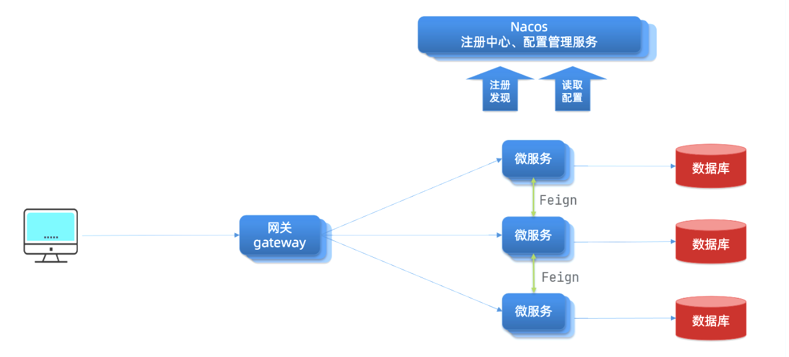

# JianGateWay 简API网关

## 明确需求

JianGateWay 实现的是一个 API 网关，处于微服务架构中的入口位置，如下图：

对标 SpringCloud Gateway ，本项目开发 JianGateWay  网关功能包括：

- **路由转发**
- **负载均衡**
- **熔断限流**
- **校验鉴权**
- **路径重写**
- **日志监控**
- **服务灰度发布**
- .........（待扩展）

## 技术选型

- **原生 Java** ：作为中间件，尽可能薄
- **Netty** ：高性能、易用的网络编程框架
- **Nacos**：配置中心、注册中心
- **Disruptor**：单线程能支撑每秒 600万 请求的高性能无锁缓存队列
- **Redis + Lua**：内存数据库，请求计数统计
- **Caffine**：高性能缓存，提升并发能力
- **Json Web Tokens** ：跨域身份验证工具，实现用户校验鉴权
- **Promethus + Grafana** ：系统监控及可视化
- .......

## 整体框架

.png)

1. Common：公共模块，提供基本的工具类，定义常量、异常信息等
2. Client：客户端模块，提供快速对接不同微服务技术栈的框架
3. Core：核心模块，JianGateWay 的核心实现
4. Register Center：注册中心模块，负载服务的发现、注册
5. Config Center：配置中心模块，负载管理网关相关配置

