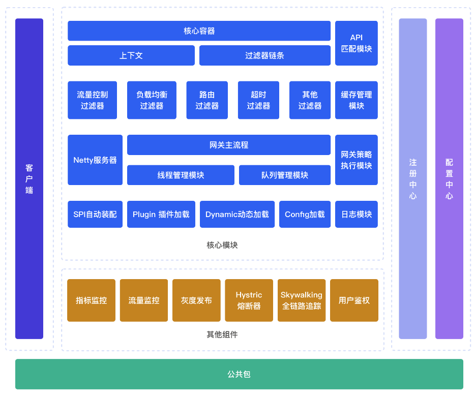

# 【JianGateWay】简网关

## JianGateWay 技术栈

- 技术框架：原生Java
- 网路通信框架：Netty
- 注册中心：Nacos
- 配置中心：Nacos

## JianGateWay 技术要点

### 1 异步化设计：CompletableFuture

需要异步化的地方：

- **请求转发** 异步化
- **请求响应** 异步化
- **插件过滤** 异步化

网关异步模式：

- 插件过滤使用 **单异步模式**
- 请求响应使用 **双异步模式**

> 单异步模式：在任意时刻，只有一个方向的数据传输。
>
> 双异步模式：两个设备之间能够双向异步传输。

### 2 使用缓存

尽量使用 **内存** 最为缓存（`Map`、`Queue`）

### 3 提高吞吐量

在流量高峰时使用本地缓冲（`Disruptor`）

### 4 工作线程设置

- CPU 密集型：该任务需要大量运算，**应设置线程数量和 CPU 数量相同** ，一般配置不会超过 `CPU 数量+1` ，这样可以避免 CPU 来回切换。
- IO 密集型：该任务需要大量的 IO，达到性能极限时，CPU 占用率仍很低。一般设置 工作线程为 `CPU 核数 * 2`。

## JianGateWay 架构

